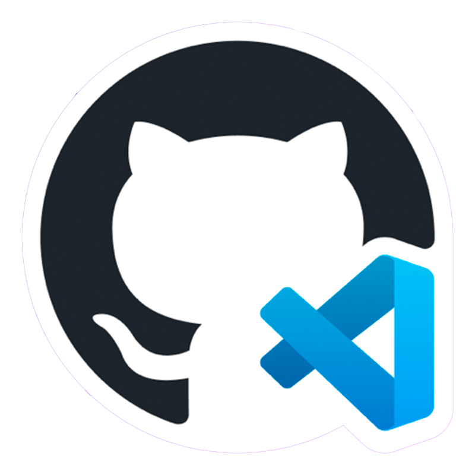

**WEB DESIGN 2**
A.A **2022-2023**
Matricola *857*
Prof. **Matteo Baccan**

<!-- _paginate: false -->
<!-- _footer: "" -->
<!-- style: "
img[alt~='center'] {
  display: block;
  margin: 0 auto;
}

header{
  font-family: 'Avenir', serif;
}
" -->

---

## Pagine

Per questo progetto ho creato un sito e-commerce sulla vendita di caffettiere personalizzate, composto da
**5 pagine collegate tra di loro:** 
- Home
- Pagina prodotto (x3)
- Carrello
- About us
- Contatti

Queste pagine hanno in comune una **headline** e un **footer** uguali graficamente in tutte le pagine.

---

## Strumenti

Per programmare le pagine di questo sito ho utilizzato **Codespace**, l'ambiente di sviluppo gratuito di **Github**   basato sul cloud che consente agli sviluppatori di creare, testare e distribuire le loro applicazionidirettamente dalla piattaforma GitHub.

CodeSpace **semplifica e accelera il processo di sviluppo** delle applicazioni e **promuove la collaborazione tra gli sviluppatori** all'interno della piattaforma GitHub.

---
# Strumenti usati

Per vedere l'anteprima del mio sito, ho collegato il mio repository a questo link di netlify: (https://gnemmi-moka.netlify.app/)

**Netlify** è una società di cloud _computing remote-first_ che offre una piattaforma di sviluppo che include build, deployment e servizi di back-end serverless per applicazioni Web e siti Web dinamici. La piattaforma è costruita su standard web aperti, rendendo possibile l'integrazione di strumenti di compilazione, framework web, API e varie tecnologie web in un flusso di lavoro unificato per gli sviluppatori.

---

# Strumenti usati
Per la creazione di alcune parti del mio sito, ho utilizzato **Bootstrap**, in modo da aiutarmi a gestire in maniera più responsive gli spazi.
Bootstrap è un framework di sviluppo web gratuito e open source, progettato per facilitare il processo di sviluppo web di siti responsive e mobile-first, fornendo una raccolta di sintassi per i modelli di progettazione.

---

