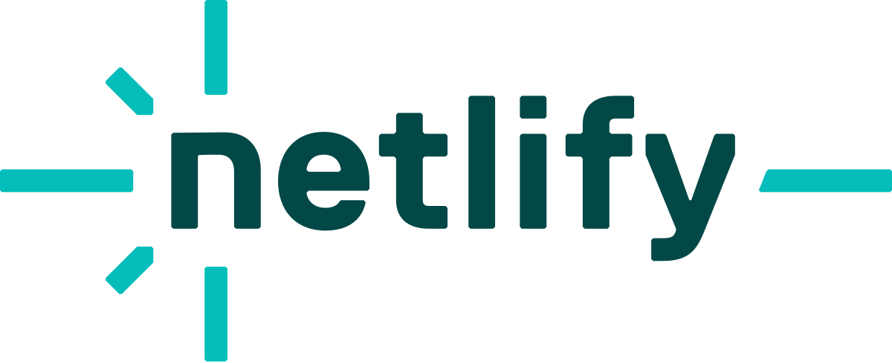

**WEB DESIGN 2**
A.A **2022-2023**
Matricola *857*
Prof. **Matteo Baccan**

<!-- _paginate: false -->
<!-- _footer: "" -->
<!-- style: "
img[alt~='center'] {
  display: block;
  margin: 0 auto;
}

header{
  font-family: 'Avenir', serif;
}
" -->

---

## Pagine

Per questo progetto ho creato un sito e-commerce sulla vendita di caffettiere personalizzate, composto da
**5 pagine collegate tra di loro:** 
- Home
- Pagina prodotto (x3)
- Carrello
- About us
- Contatti

Queste pagine hanno in comune una **headline** e un **footer** uguali graficamente in tutte le pagine.

---

## Strumenti

Per programmare le pagine di questo sito ho utilizzato **Codespace**, l'ambiente di sviluppo gratuito di **Github**   basato sul cloud che consente agli sviluppatori di creare, testare e distribuire le loro applicazionidirettamente dalla piattaforma GitHub.

CodeSpace **semplifica e accelera il processo di sviluppo** delle applicazioni e **promuove la collaborazione tra gli sviluppatori** all'interno della piattaforma GitHub.

---
# Strumenti usati

Per vedere l'anteprima del mio sito, ho collegato il mio repository a questo link di netlify: (https://gnemmi-moka.netlify.app/)

**Netlify** è una società di cloud _computing remote-first_ che offre una piattaforma di sviluppo che include build, deployment e servizi di back-end serverless per applicazioni Web e siti Web dinamici. La piattaforma è costruita su standard web aperti, rendendo possibile l'integrazione di strumenti di compilazione, framework web, API e varie tecnologie web in un flusso di lavoro unificato per gli sviluppatori.

---

# Strumenti usati
Per la creazione di alcune parti del mio sito, ho utilizzato **Bootstrap**, in modo da aiutarmi a gestire in maniera più responsive gli spazi.
Bootstrap è un framework di sviluppo web gratuito e open source, progettato per facilitare il processo di sviluppo web di siti responsive e mobile-first, fornendo una raccolta di sintassi per i modelli di progettazione.

---

# Elementi comuni

_Headline & Footer_

---

## Headline

Nella parte sinistra troviamo il **logo**, che se cliccato, funge da collegamento alla pagina home.
Di seguito abbiamo le tre pagine principali: **Home, ABout us e Contatti** che anche loro fungono da collegamento alle loro pagine.
Nella parte destra troviamo l'icona del **carrello** in cui, grazie alla funzione 'aggiungiAlCarrello' e 'rimuoviDalCarrello', associate ai tasti presenti sotto ai box prodotti, possiamo vedere il numero di questi inseritovi dentro.
Inoltre, questa icona funge da collegamento alla pagina del carrello stesso.
---
## Footer

Nel footer troviamo la mappa e i contatti **due elementi inline** che, allo stringersi della pagina, si posizionano uno sotto l'altro grazie ad una **media query**.

---

# Pagine singole

_Home - Prodotto - Carrello - About us- Contatti_

---
## Home page

Nella home page troviamo uno slider, un titolo e le tre caselle prodotto.
- Lo slider, cui codice nativo è stato preso da https://swiperjs.com/, contiene 6 immagini di dolci che scorrono una dopo l'altra grazie alla funzione Javascript 'autoplay'.

---
## Home page
Codice in js dello slider

---
## Home page

- Sotto alla scitta ci sono le tre caselle prodotto che, usando la class 'card h-100', contengono l'immagine del prodotto, il suo nome, la descrizione, il costo e i tasti collegati al carrello per aggiungere o togliere quantità.

Al passaggio del puntatore sulle immagini dei prodotti, queste diminuiscono l'opacit.
Cliccandoci su invece, si viene reindirizzati alla pagine del prodotto stesso.

---

## Pagina prodotto 

Nella pagina prodotto troviamo un container fluido di boostrap, contenente due colonne in cui è inserita la foto del prodotto e le informazioni a riguardo.

Il box si presenta bianco con un'ombra marrone all'esterno; nella parte delle informazioni sono presenti tre **menù a tendina** il cui codice nativo è stato preso da https://getbootstrap.com/, che permettono di scegliere tutte le personalizzazioni del prodotto.

---

## Uso dell'Ai nel Carrello

ChatGPT mi ha aiutata nella creazione del codice per poter far funzionare i calcoli all'interno del carrello.

---
## Carrello 

Cliccando nell'icona in alto a destra, veniamo reindirizzati alla pagina carrello. Qui è presente sempre un container fluido, con più righe e colonne.
All'interno sono riportati l'immagine del prodotto, il suo costo e la quantità che desideriamo (con una casella di testo editabile), il prezzo totale e la presenza delle personalizzazioni.

---

## Carrello

Aumentando la quantità di prodotto desiderato, si attiverà una funzione di calcolo 'updateCosts' che aggiornernerà il costo totale del prodotto moltiplicando il costo base per la quantità inserita.
Inoltre, sommerà i costi totali dei vari prodotti presenti nel carrello per avere un subtotale 'subTotal', visibile nella riga **Totale prodotti**, per poi aggiungergli i costi di spedizione 'shippingCost' e aggiornare così il costo totale 'grandTotal' visibile nella riga **Totale**.

---
## Carrello
Codice in js del carrello

---
## About us 

Il corpo della pagina **chi siamo** è diviso in 3 riquadri, ognuno per ogni membro del teamr.
Le card sono composte da una foto circolare, il nome, la posizione lavorativa e la spiegazione dell'attività.

---
## Contatti 

La pagina dei **contatti** è formata da tre sezioni per inserire le proprie credenziali: il nome, la mail e il messaggio.
Una volta accettati i termini e le condizioni, quando viene inviato il messaggio, si riceverà un messaggio per confermare l'invio.

---

# Responsive delle pagine

Adattamenti creati grazie alle **media query**

---

**COMPUTER**
Compresi tra **992px e 1200px**

---

**TABLET**
Compresi tra **768px e 992px**

---

**TELEFONO**
Compresi tra **576px e 768px**

---
# Prestazioni

PageSpeed Insights https://pagespeed.web.dev/ è uno strumento gratuito di Google che permette di misurare la velocità di caricamento di una pagina web e le sue prestazioni.

